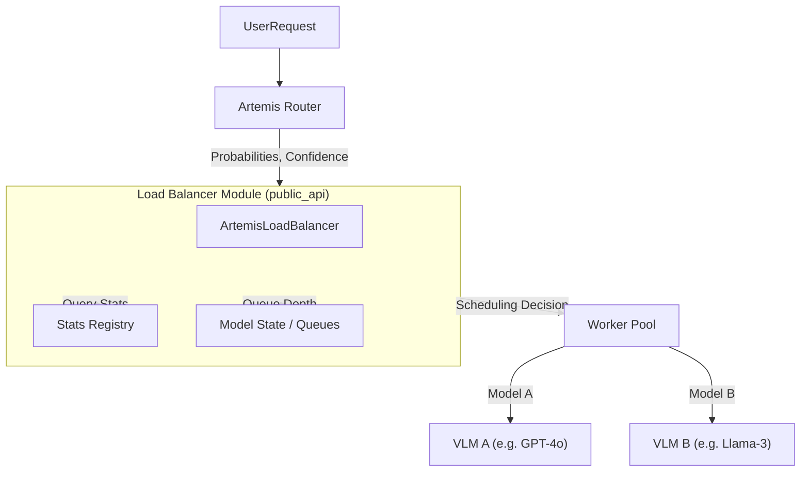

# Artemis Load Balancer

## 1. Overview

The **Artemis Load Balancer** is the decision-making engine of the Artemis VLM Router system. While the **Router** determines *which* models are theoretically best for a given query based on semantic content, the **Load Balancer** determines *where* and *when* to send that query based on real-world constraints: system latency, cost budgets, and accuracy targets.

### High-Level Architecture



---

## 2. Directory Layout & Core Components

The module is organized to expose a clean public API while encapsulating complex scheduling logic.

### Public Interface
*   **`public_api.py`**: The main entry point. Exposes `ArtemisLoadBalancerModule` and global helpers (`init_load_balancer`, `schedule_request`). **Use this for all external integrations.**
*   **`types.py`**: Shared data classes (`RouterOutput`, `SchedulingContext`, `SchedulingDecision`).
*   **`load_balancer_service.py`**: Service wrapper for HTTP/FastAPI integration. Delegates logic to the public API.

### Core Logic
*   **`scheduler.py`**: Contains `ArtemisLoadBalancer`, the core scheduling engine. Also manages mode switching and budget tracking.
*   **`model_state.py`**: Tracks dynamic state (queue depths, replica counts) and handles simulation logic.
*   **`stats_registry.py`**: Manages static performance profiles (latency, accuracy, cost) loaded from off-line profiling.
*   **`sla_monitor.py`**: Tracks SLA compliance and computes aggregate metrics (p95 latency, violation rates).

### Configuration & Support
*   **`config.py`**: Configuration constants and loading utilities.
*   **`metrics_logger.py`**: Utilities for logging decisions to CSV/JSONL.
*   **`wandb_logger.py`**: Integration with Weights & Biases for experiment tracking.

---

## 3. How to Use

### Initialization
You should interact with the load balancer via the **Public API**.

```python
from load_balancer.public_api import init_load_balancer, schedule_request, get_metrics

# 1. Initialize (loads config and stats automatically)
init_load_balancer(config_path="path/to/capacity_config.yaml")
```

### Scheduling a Request
Pass the router's output to the scheduler.

```python
# 2. Schedule
decision = schedule_request(
    sample_id="test_001",
    task_type="vqa",
    router_probs={"gpt-4o": 0.9, "llama-3": 0.1},
    preferred_model="gpt-4o"
)

print(f"Chosen Model: {decision['chosen_model']}")
print(f"Est Latency: {decision['total_latency_ms']} ms")
```

### Checking Metrics
```python
# 3. Monitor
metrics = get_metrics()
print(f"SLA Violation Rate: {metrics['violation_rate']:.2%}")
```

---

## 4. Configuration

The load balancer is driven by `load_balancer_config.yaml` (or equivalent capacity config).

### Key Sections
*   **`models`**: Define available models, their base latency, cost, and capacity (max QPS).
*   **`global_sla_ms`**: Default latency target (e.g., 2000ms).
*   **`routing_mode`**: The default strategy (e.g., `balanced`, `accuracy`, `cheap`).

Example:
```yaml
models:
  gpt-4o:
    base_latency_ms: 1500
    cost_per_request_usd: 0.01
    max_qps_per_replica: 5.0
  llama-3-8b:
    base_latency_ms: 200
    cost_per_request_usd: 0.0002
    max_qps_per_replica: 20.0
```

---

## 5. Routing Modes

The scheduler supports dynamic routing strategies:

1.  **`router` (Default)**: Follows the Semantic Router's preference unless the queue is too full (violates SLA).
2.  **`accuracy`**: Always picks the model with the highest historical accuracy for the task.
3.  **`fast`**: Picks the model with the lowest predicted total latency (service time + queue wait).
4.  **`cheap`**: Picks the lowest cost model.
5.  **`balanced`**: A utility-based approach optimizing for Cost & Accuracy within Latency constraints.

Mode switching can happen dynamically if the system detects frequent SLA violations or budget exhaustion.

---

## 6. Simulation & Experiments

Use `run_experiment.py` (or notebooks) into `evaluation/` to run offline simulations.

1.  **Load Data**: Reads a profiling dataset (requests + router outputs).
2.  **Simulate**: Feeds requests into the LB at a specified rate (Load Profile).
3.  **Analyze**: Outputs `results.csv` and `simulation_metrics.json`.

**Key Notebooks:**
*   `00_pipeline_tutorial.ipynb`: Walkthrough of the basic concepts.
*   `02_load_balancer_stress_test.ipynb`: Stress testing queues and autoscaling logic.

---

## 7. Metrics & Logging

The module tracks detailed metrics for every request:
*   **Latency**: Service Time, Queue Delay, Total Latency.
*   **Cost**: Estimated USD cost per query.
*   **Accuracy**: Expected accuracy based on historical stats.
*   **Decisions**: Which model was chosen vs preferred, and why (e.g. SLA violation fallback).

Logs can be sent to:
*   **CSV/JSONL**: Local files for debugging.
*   **W&B**: Dashboard tracking (if enabled).

---

## 8. Development

### Adding a new Policy
Modify `ArtemisLoadBalancer` in `scheduler.py` to add a new `_schedule_custom_mode` method and register it in the main `schedule` loop.

### Validation
Run the provided notebooks or use the public API to create synthetic load scripts.
