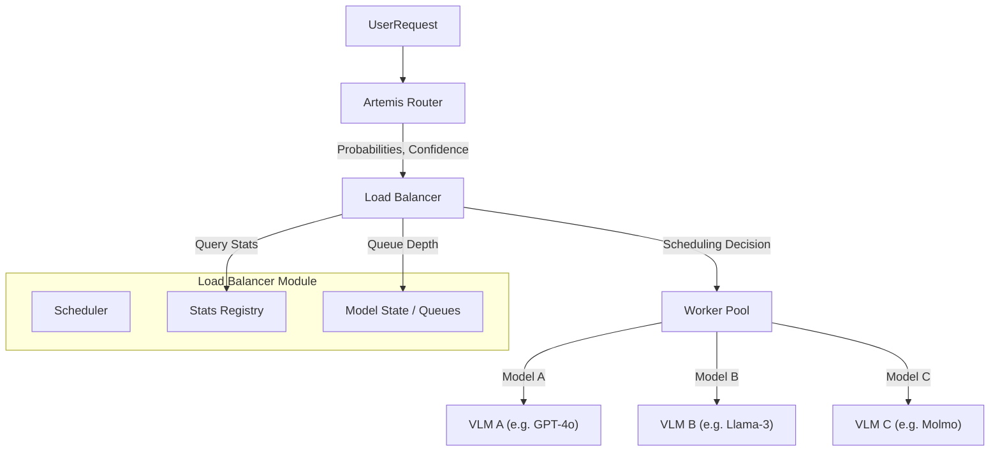

# Artemis Load Balancer

## 1. Overview

The **Artemis Load Balancer** is the decision-making engine of the Artemis VLM Router system. While the **Router** determines *which* models are theoretically best for a given query based on semantic content, the **Load Balancer** determines *where* and *when* to send that query based on real-world constraints: system latency, cost budgets, and accuracy targets.

### Why do we need it?
A smart router alone is insufficient for production.
- **Latency Spikes**: The "best" model might be overwhelmed with requests.
- **Cost Controls**: We may need to degrade slightly to a cheaper model to stay within budget.
- **SLA Enforcement**: Different tasks have different latency requirements (e.g., OCR needs to be faster than heavy reasoning).
- **Fallbacks**: If the router is unsure (low confidence), we need a robust fallback strategy (Top-K consensus or safe defaults).

### High-Level Architecture



---

## 2. Core Responsibilities

The Load Balancer is responsible for converting a **Router Request** into a **Scheduling Decision**. Its core loops involve:

1.  **Input Processing**: Receives `preferred_model`, `model_probabilities`, and `confidence_score` from the router.
2.  **State Tracking**: Maintains real-time queues for every model replica to predict wait times.
3.  **Stats Lookup**: Retrieves static performance profiles (avg latency, accuracy, cost) from `StatsRegistry`.
4.  **Constraint Solving**:
    *   **Latency SLAs**: Filters out candidates that will likely miss the task's deadline.
    *   **Cost Efficiency**: Selects the cheapest model that meets the criteria (in `cheap` or `balanced` modes).
    *   **Accuracy Maximization**: Prioritizes the most capable models (in `accuracy` mode).
5.  **Fallback Logic**: If the router's confidence is low, it evaluates the top-K models to find a safer or more readily available option.
6.  **Simulation & Enforcement**: Tracks cumulative cost/latency to simulate budget exhaustion or SLA violations.

---

## 3. Key Components

### `stats_registry.py`
The single source of truth for static model performance metrics.
*   **Schema**: Expects JSON with `avg_latency_ms`, `avg_accuracy`, `cost_per_request_usd`.
*   **Methods**: `estimate_service_time_ms`, `estimate_accuracy`, `estimate_cost_usd`.
*   **Behavior**: Lazy loads from disk. Returns safe defaults (1000ms, 0.0 accuracy, $0 cost) if stats are missing, logging a warning once.

### `model_state.py`
Manages the dynamic state of the system.
*   **Replica Queues**: Tracks how many requests are currently pending for each model replica.
*   **Autoscaling**: Supports scaling model replicas up/down (simulated).
*   **Latency Prediction**: `predicted_latency = current_queue_depth * avg_service_time + avg_service_time`.

### `scheduler.py`
The brain of the operation containing the `ArtemisLoadBalancer` class.
*   **Routing Modes**: Implements the logic for `router`, `accuracy`, `fast`, `cheap`, and `balanced`.
*   **Candidate Selection**: Filters available models based on SLAs and Top-K logic.
*   **Decision Building**: Constructs the final `SchedulingDecision`.
*   **Accuracy Drop Rule**: Prevents switching to a cheaper model if the accuracy loss is too high (e.g., > 5%).

### `sla_monitor.py`
Observability module for SLA compliance.
*   **Metrics**: computes p50, p95, p99 latency.
*   **Tracking**: Counts total requests vs. violations per task type.

### `metrics_logger.py`
Handles persistence of decisions and outcomes.
*   **Formats**: Supports CSV and JSONL logging.
*   **Integrations**: Can log to Weights & Biases (W&B) if configured.

### `load_balancer_service.py`
The FastAPI interface for online serving.
*   **API**: Exposes a `/schedule` endpoint.
*   **Flow**: Accepts JSON payload -> runs Scheduler -> returns Decision JSON.

---

## 4. Data Requirements

The load balancer relies on offline statistics generated by **Ares**. 
**Expected File**: `artemis_final/ares/aggregates/per_task_model_stats.json`

**JSON Schema**:
```json
{
  "task_type": {
    "model_name": {
      "avg_latency_ms": 150.0,
      "avg_accuracy": 0.95,
      "cost_per_request_usd": 0.0005
    }
  }
}
```

*   **Latency**: Used to compute expected service time and queue drain rates.
*   **Accuracy**: Used to rank models in `accuracy` mode and prevent degradation in `balanced` mode.
*   **Cost**: Used to calculate `est_cost_usd` and filter models in `cheap` mode.

---

## 5. Routing Modes

The scheduler supports five distinct modes, selected via configuration or per-request override.

### 1. `router` (Default)
Trusts the semantic router's output primarily.
*   **Logic**: Tries to schedule the `preferred_model`. 
*   **Fallback**: If `preferred_model` violates strict SLAs (queue is too full), it falls back to the next best probability model.

### 2. `accuracy`
Prioritizes the highest theoretical accuracy for the task, regardless of the router's specific prediction.
*   **Logic**: Sorts valid candidates by `avg_accuracy` descending.
*   **Use Case**: Critical tasks where correctness matters more than speed or cost (e.g., Medical OCR).

### 3. `fast`
Prioritizes lowest total latency (queue wait + service time).
*   **Logic**: `score = predicted_queue_wait + avg_service_time`. Selects lowest score.
*   **Use Case**: Real-time interactive bots.

### 4. `cheap`
Prioritizes lowest cost per request.
*   **Logic**: Sorts candidates by `cost_per_request_usd` ascending.
*   **Constraint**: Usually strictly respects the Latency SLA (won't pick a cheap model if it takes 10s).

### 5. `balanced`
A hybrid approach that trades off cost for accuracy within safe latency bounds.
*   **Logic**: 
    1. Start with the most accurate model.
    2. Consider cheaper alternatives.
    3. **Switch Rule**: Only switch to a cheaper model if `accuracy_loss < threshold` (e.g. 5%) AND `cost_savings > threshold` (e.g. 50%).
    4. Must meet Latency SLA.

---

## 6. Router Confidence & Top-K

The load balancer protects against "confidently wrong" or "uncertain" router decisions.

### Confidence Threshold
*   **Input**: The router provides a `confidence_score` (0.0 to 1.0).
*   **Trigger**: If `confidence < low_confidence_threshold` (e.g. 0.4), the LB treats the router's choice as a suggestion rather than a mandate.

### Top-K Logic
*   When confidence is low, the LB expands the candidate pool from just `[preferred_model]` to the top K models (e.g., top 3) from `model_probabilities`.
*   This allows `balanced` or `fast` logic to pick a better operational fit among the semantically relevant models.

---

## 7. SLAs (Service Level Agreements)

### Latency SLA
Defined per task type (e.g., `ocr: 2000ms`, `vqa: 1000ms`).
*   **Calculation**: `Predicted Latency = (Queue Depth * Service Time) + Service Time`.
*   **Enforcement**: 
    *   **Hard Constraint**: In strict modes, models violating SLA are filtered out immediately.
    *   **Soft Constraint**: In `router` mode, we try to respect it but may violate if no other suitable model exists.
*   **Violation**: Recorded in `SchedulingDecision.sla_violated`.

### Global Cost Budget
Used primarily in Simulation (`run_experiment.py`).
*   **Logic**: The experiment stops processing requests if `cumulative_cost > MAX_BUDGET`.
*   **Purpose**: To verify if a routing strategy is economically viable at scale.

---

## 8. SchedulingDecision Format

The `schedule()` method returns a `SchedulingDecision` object (or dict):

| Field | Type | Description |
| :--- | :--- | :--- |
| `request_id` | str | Unique ID of the request. |
| `chosen_model` | str | The model selected for execution. |
| `preferred_model` | str | The original model requested by the semantic router. |
| `predicted_latency` | float | Estimated ms (wait + execution). |
| `predicted_queue_delay`| float | Estimated ms spent waiting in queue. |
| `est_cost_usd` | float | Cost of this specific request. |
| `est_accuracy` | float | Historical accuracy of `chosen_model` on this task. |
| `accuracy_drop` | float | Accuracy difference between `preferred` and `chosen`. |
| `routing_mode` | str | Mode used (e.g., "balanced"). |
| `sla_violated` | bool | True if `predicted_latency > task_sla`. |
| `metadata` | dict | Debug info, confidence scores, queue snapshots. |

---

## 9. Simulation Workflow (`run_experiment.py`)

Used for research and benchmarking different strategies.

1.  **Load Data**: Reads SQL profiling data (Tasks, Queries, Router Outputs).
2.  **Initialize**: Sets up `ArtemisLoadBalancer` with specific queues and stats.
3.  **Run Loop**:
    *   Feeds requests sequentially (or batched) into the LB.
    *   LB updates internal Queue states.
    *   Simulated "time steps" drain queues based on service rates.
4.  **Metrics**:
    *   Tracks `Total Cost`, `Avg Latency`, `Throughput`, `SLA Violation %`.
5.  **Output**: Saves `simulation_results.json` and `results.csv`.

---

## 10. Online Workflow (`load_balancer_service.py`)

Used for production deployment.

1.  **Request**: External service sends `POST /schedule`.
    ```json
    {
      "task_type": "chart_qa",
      "router_output": { "preferred_model": "gpt-4o", "confidence": 0.9, ... }
    }
    ```
2.  **Processing**: `ArtemisLoadBalancer.schedule(...)` runs.
3.  **State Update**: The queue for the chosen model is incremented.
    *   *Note*: In a real distributed system, we would need a callback to decrement the queue when the job finishes.
4.  **Response**: Returns the `SchedulingDecision` JSON.

---

## 11. How to Run the Notebooks

We provide a suite of notebooks in `artemis_final/notebooks/load_balancer/` to demonstrate functionality.

1.  **`01_single_request_walkthrough.ipynb`**
    *   **Goal**: Hello World. Manually creates a request and sees one decision.
    *   **Run**: Open in Jupyter, execute cells. No external deps required.

2.  **`02_load_balancer_stress_test.ipynb`**
    *   **Goal**: Simulates high concurrency. Shows how queues fill up and how LB shifts traffic to backup models.
    *   **Key Viz**: Latency over time graphs.

3.  **`03_routing_modes_comparison.ipynb`**
    *   **Goal**: Runs the same dataset through all 5 modes.
    *   **Outcome**: Compare Cost vs. Accuracy vs. Latency trade-offs.

---

## 12. Extending the Load Balancer

### Adding a New Routing Mode
1.  Open `scheduler.py`.
2.  Locate `_select_best_candidate`.
3.  Add case: `if self.mode == 'custom_mode': return self._select_custom(...)`.
4.  Implement selection logic (sorting candidates).

### Dynamic SLA Adaptation
*   Modify `sla_monitor.py` to observe rolling window latency.
*   Update `scheduler.py` to adjust `task_sla` thresholds at runtime based on monitor feedback.

### Live Endpoint Integration
*   Currently, execution is simulated via stats.
*   To go live, wrap `SchedulingDecision` in a `Dispatcher` that makes the actual HTTP call to the VLM inference service.

---

## 13. FAQ / Troubleshooting

**Q: I see "Missing stats" warnings in the logs.**
*   A: Your `stats_registry.py` loaded a file that is missing an entry for that specific `task_type` + `model_name`. Run Ares generation scripts or add the missing entry to the JSON.

**Q: Why is the LB choosing a "worse" model in `router` mode?**
*   A: Check the queues. If the preferred model has a massive queue, the SLA check might be forcing a fallback to a faster, less accurate model.

**Q: Autoscaling doesn't seem to work.**
*   A: Autoscaling is currently a simulation parameter in `model_state.py`. Ensure `enable_autoscaling=True` and that queue depths represent valid threshold pressure.

**Q: My cost is always $0.**
*   A: Ensure your input stats JSON has `cost_per_request_usd` populated (not 0.0) for the models you are using.

---

## 14. Glossary

*   **SLA (Service Level Agreement)**: A contract defining the maximum acceptable latency for a task (e.g., 2000ms).
*   **Replica**: A single instance of a model. More replicas = higher throughput = faster queue drain.
*   **Queue Depth**: Number of requests waiting to be processed by a replica.
*   **Service Time**: Time taken by the model to actually process the request (excluding wait time).
*   **Utility**: A synthetic score used in `balanced` mode combining accuracy and cost.
*   **Router Confidence**: A 0-1 score indicating how certain the semantic router is about its classification.
