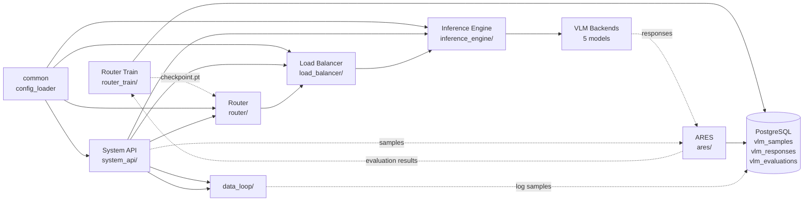

# Project Map — ARTEMIS
>
> Last updated: 2026-06-20 | Source: docs/meta/SCAN_MANIFEST.json

## Directory Index

| Directory | Type | Responsibility | Entry Point |
|---|---|---|---|
| `artemis_final/router/` | Module | VLM routing: DistilBERT + MLP reward prediction (3 architectures) | `router/public_api.py::init_router()` |
| `artemis_final/load_balancer/` | Module | SLA-aware capacity scheduling; queue management; SLA monitoring | `load_balancer/public_api.py::ArtemisLoadBalancerModule` |
| `artemis_final/ares/` | Module | Evaluation: Scorer + VLMJudge (Molmo) + Glider; PostgreSQL ops | `ares/evaluation/router_eval_pipeline.py` |
| `artemis_final/inference_engine/` | Module | OpenAI-compatible VLM inference client | `inference_engine/runners.py::OpenAIStyleRunner` |
| `artemis_final/router_train/` | Module | Router training from PostgreSQL data; notebooks as primary entry | `router_train/notebooks/02_reward_router_sql_to_training.ipynb` |
| `artemis_final/data_loop/` | Module | Online logging and periodic retraining | `data_loop/collector.py::DataCollector` |
| `artemis_final/system_api/` | Module | FastAPI app: OpenAI-compatible /v1/chat/completions | `system_api/main.py` |
| `artemis_final/common/` | Module | Shared config loading and type definitions | `common/config_loader.py::load_global_config()` |
| `artemis_core/src/artemis/` | Module | Minimal reference implementation (~859 lines) | `artemis_core/src/artemis/router/router.py::ArtemisRouter` |
| `code_base/cascadeflow/` | Research | Cascade routing: sequential VLM queries with quality threshold | `cascadeflow/routing/domain.py::DomainDetector` |
| `code_base/frugal_gpt/` | Research | FrugalGPT model selection (NotImplementedError in key paths) | `FrugalGPT/src/service/modelservice.py` |
| `code_base/lovm/` | Research | LOVM orchestration and VLM profiling | `lovm/lovm/lovm.py::LOVM` |
| `code_base/which_vlm/` | Variant | Legacy/alternative ARTEMIS variants — do not use | — |
| `code_base/aurelio/` | Dataset | Pivot dataset utilities; train/test parquet | — |
| `examples/` | Examples | Load balancer, router, and ops examples | `examples/README.md` |
| `artemis_final/checkpoints/` | Data | Trained router `.pt` files | — |
| `artemis_final/configs/` | Config | `artemis.yaml` master config | — |

## Top-Level Entry Points

| Command / Script | File | What It Does |
|---|---|---|
| `docker-compose up` | `docker-compose.yml` | Full stack: FastAPI server + PostgreSQL |
| `python -m uvicorn system_api.main:app` | `system_api/main.py` | Start FastAPI server directly (dev) |
| `python artemis_core/main.py` | `artemis_core/main.py` | Run minimal ARTEMIS pipeline (ref impl) |
| `jupyter notebook` | `notebooks/` | Training (router_train/notebooks/), evaluation (ares/), router experiments |
| `bash artemis_final/scripts/run_demo.sh` | `artemis_final/scripts/run_demo.sh` | Full pipeline demo |
| `pytest` | `artemis_final/tests/` | Run unit tests |

## Module Dependency Graph

**Dependency summary (who imports whom):**

| Module | Depends On | Required By |
|---|---|---|
| `system_api` | router, load_balancer, inference_engine, data_loop, common | — (entry point) |
| `router` | common | system_api, load_balancer, ares |
| `load_balancer` | common | system_api, router |
| `inference_engine` | common | system_api, ares |
| `ares` | common, inference_engine, router | data_loop |
| `router_train` | common, ares (for evaluation data) | router |
| `data_loop` | common, router_train | system_api |
| `common` | — (leaf) | all modules |

## Cross-Module Data Contracts

| Contract | Defined In | Used By | Key Fields |
|---|---|---|---|
| `RouterOutput` | `load_balancer/core/types.py` | LB, System API | sample_id, task_type, router_probs, preferred_model, max_prob |
| `SchedulingDecision` | `load_balancer/core/types.py` | System API, IE | chosen_model, is_overloaded, est_latency_ms, est_cost_usd, queue_delay_ms, sla_violated |
| `Sample` | `router/core/schemas.py` | Router, ARES, DB | sample_id, source, text, image, label, metadata |
| `RouterDecision` | `router/core/schemas.py` | Router, LB | chosen_model, probs, raw_logits, model_order, inference_ms |
| `GlobalConfig` | `common/config_loader.py` | All modules | db.url, router.checkpoint_path, LB config, IE models |
| `TrafficSimulationResult` | `load_balancer/public_api.py` | System API | avg_latency_ms, p95_latency_ms, sla_violation_rate, avg_cost_usd |
| `BudgetExhaustedError` | `load_balancer/core/types.py` | System API | Raised when no model meets constraints → HTTP 503 |

## External Models and Services

| Dependency | Version | Used By | Purpose |
|---|---|---|---|
| DistilBERT | `distilbert-base-uncased` | router | Frozen text encoder (66M params, 768-dim output) |
| VLM Backends (5) | API | inference_engine | qwen2_5_vl_3b, qwen2_5_vl_7b, qwen3_vl_8b_thinking, gemma_3_27b, deepseek_ocr — all via OpenAI-compatible `/v1/chat/completions` |
| PostgreSQL | 14+ | ares, router_train | Persistent storage: samples, responses, evaluations |
| Molmo | latest | ares | VLM Judge — listwise ranking of model responses with image |
| Glider | latest | ares | Text-only fast evaluator (optional; loads heavy model) |
| Weights & Biases | — | router | Optional experiment tracking (disabled by default) |
| Docker | 20.10+ | deployment | Containerized deployment via docker-compose |

## Config Files

| File | What It Controls | Format |
|---|---|---|
| `artemis_final/configs/artemis.yaml` | Master config: DB URL, router checkpoint path, LB settings, IE models | YAML |
| `artemis_final/router/router_config_reward.yaml` | Router MLP architecture: dims, model list, embedding sizes, float32 precision | YAML |
| `artemis_final/ares/configs/models.yaml` | VLM backend URLs, API keys, model types per VLM | YAML |
| `artemis_final/load_balancer/core/config.py` | Default capacity config, SLA targets | Python dataclass |
| `artemis_final/router_train/data/model_index.json` | Model name → integer index mapping (MLP output order) | JSON |
| `artemis_final/router_train/data/mode_index.json` | Mode name → integer index mapping | JSON |
| `artemis_final/router_train/data/task_index.json` | Task type → integer index mapping | JSON |
