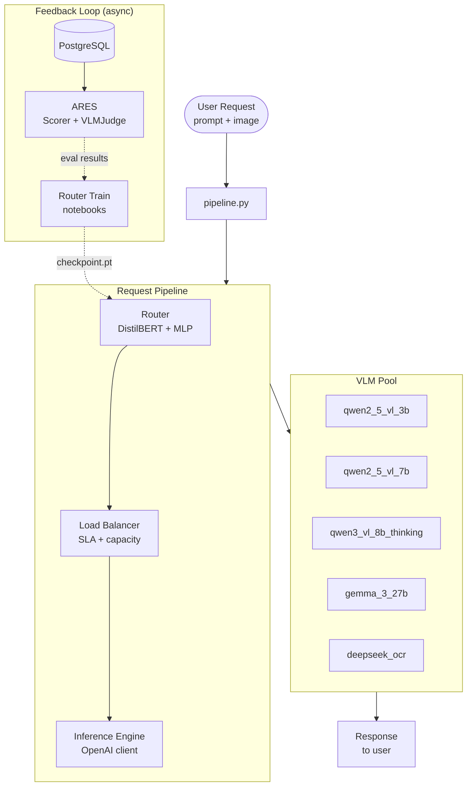
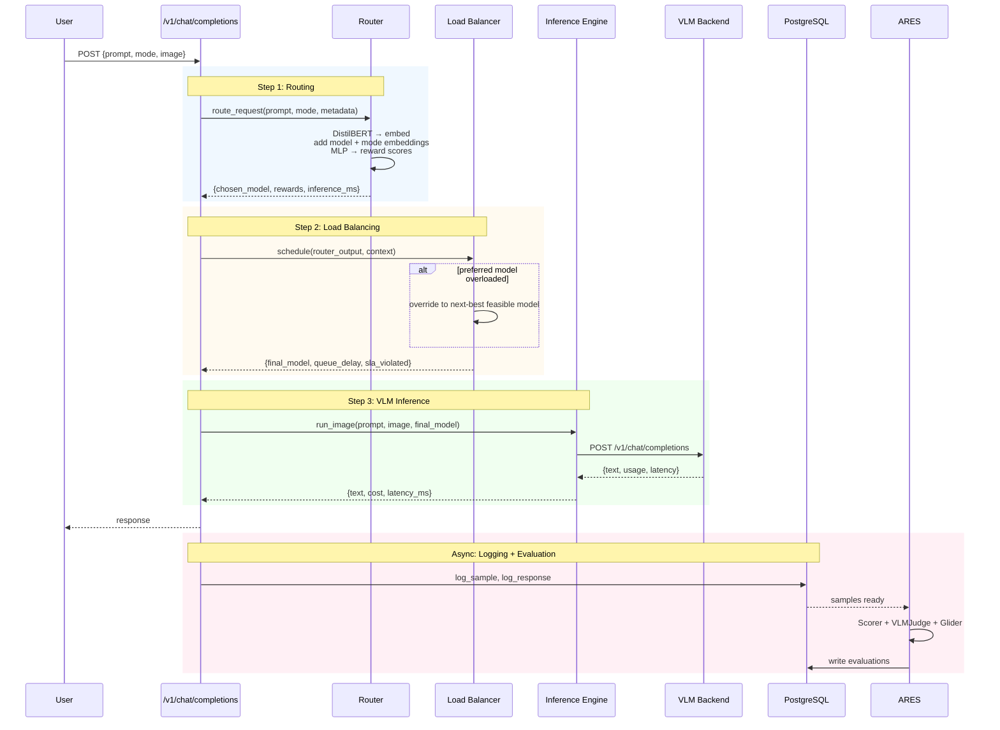
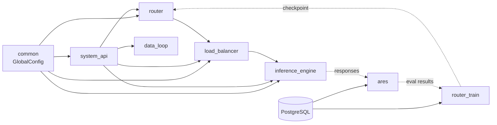

# ARTEMIS — Architecture

## What It Is

ARTEMIS is a system that automatically chooses which Vision-Language Model (VLM) to use for each incoming request. Rather than sending every query to the most capable (and most expensive) model, it uses a lightweight neural network to predict which of five available VLMs will produce a good enough answer at the lowest cost. The system has four stages: a **router** predicts reward scores, a **load balancer** enforces operational constraints, an **inference engine** calls the chosen VLM, and an **evaluation pipeline** scores the results to feed back into retraining.

The design is built around two key ideas. First, the router is deliberately cheap — it uses frozen text encoders (DistilBERT) and a small MLP, so routing adds only 5–50ms of latency regardless of which VLM is called. Second, the load balancer sits between the router and the VLM to prevent the router's choices from overwhelming any single backend, enforcing latency targets and queue limits.

## System Overview

## Data Flow

1. A user POSTs to `/v1/chat/completions` with a prompt, optional image, and `router_mode`.
2. The FastAPI app calls `handle_chat_completion()`, which passes the request to the Router.
3. The Router encodes the text with frozen DistilBERT, concatenates model-type and mode embeddings, runs the MLP, and returns reward scores for all five VLMs.
4. The Load Balancer receives `{chosen_model, rewards}` and checks SLA + queue capacity. If the preferred model is overloaded, it redirects to the next-best feasible model.
5. The Inference Engine calls the selected VLM's OpenAI-compatible endpoint with the prompt and image.
6. The response is returned to the user. Meanwhile, the sample and response are logged to PostgreSQL.
7. Asynchronously, ARES runs evaluation (Scorer + VLM Judge + optional Glider) and writes results back to the database.
8. Periodically, the router is retrained on accumulated evaluation data and hot-swapped into production.

## Module Dependencies

## Component Descriptions

### Router (`artemis_final/router/`)

The router is the decision-making core. It encodes text with frozen DistilBERT, adds learned embeddings for each of the five target VLMs and for the current routing mode, then passes the combined vector through an MLP to produce reward scores. The model with the highest score wins. Three architectures are available:

- **Reward** (recommended) — predicts a scalar reward per VLM via MSE loss; most flexible
- **Pairwise** — learns a margin-based ranking; best for high-accuracy routing
- **Classical** — cross-entropy classification; fastest convergence

The router is intentionally lightweight (DistilBERT is frozen). Its inference adds <5% latency overhead on GPU. **Status: PARTIAL.** Router inference is fully functional. Traffic simulation (`traffic_simulator.py:142`) raises `NotImplementedError`. See [router.md](modules/router.md) for details.

### Load Balancer (`artemis_final/load_balancer/`)

After the router picks a model, the load balancer checks whether that choice respects operational constraints. It verifies the SLA latency target for this task type, checks how many requests are currently in-flight for that model, and can override the router's choice if neither constraint would be met. Decisions are tracked in a rolling `SlaMonitor` and a `StatsRegistry` for historical analysis. **Status: PARTIAL.** Scheduling + SLA monitoring work. Config override handling has TODOs. See [load_balancer.md](modules/load_balancer.md).

### Inference Engine (`artemis_final/inference_engine/`)

A thin OpenAI-compatible client that calls VLM backends via the standard `/v1/chat/completions` interface. It handles both text-only (LLM) and image+text (VLM) requests, extracts token usage and cost from responses, and tracks per-call latency. **Status: PLACEHOLDER.** The client structure exists but key methods return `False` and cannot run inference. This blocks the full pipeline from end-to-end execution. See [inference_engine.md](modules/inference_engine.md).

### ARES (`artemis_final/ares/`)

The evaluation and data pipeline. `RouterEvalPipeline` runs three evaluators in parallel:

- **Scorer** — compares responses against ground truth labels (accuracy, F1, precision, recall)
- **VLMJudge** (Molmo) — ranks all model responses for a sample listwise using the actual image
- **GliderEvaluator** — optional text-only fast evaluator (loads a heavy model)

Results are written to PostgreSQL, where `router_train` picks them up for retraining. **Status: PLACEHOLDER.** The evaluation pipeline structure is comprehensive but has `return None` stubs in error paths and depends on a working inference engine. See [ares.md](modules/ares.md).

### Router Training (`artemis_final/router_train/`)

The training pipeline loads profiling data (samples, responses, evaluations) from PostgreSQL, computes multi-objective reward functions per (sample, model, mode), and trains the router MLP with the appropriate loss. Four reward modes:

- `accuracy`: A² × H (accuracy squared times helpfulness)
- `cheap`: A × H − w × cost^e (accuracy minus cost penalty)
- `fast`: A × H − w × latency^e (accuracy minus latency penalty)
- `balanced`: multi-objective combination

**Status: PLACEHOLDER.** Model architectures, reward functions, and training notebooks are fully functional. The `service.py` service layer has placeholder returns — use notebooks directly. See [router_train.md](modules/router_train.md).

### System API (`artemis_final/system_api/`)

FastAPI application wiring all services together. Exposes `/health`, `/v1/chat/completions` (OpenAI-compatible), `/feedback`, and `/admin/retrain`. Uses `pipeline.py::init_system()` to instantiate Router + Load Balancer + Inference Engine + DataCollector at startup. **Status: COMPLETE.** Endpoints are functional; downstream services must work for end-to-end requests. See [system_api.md](modules/system_api.md).

### Data Loop (`artemis_final/data_loop/`)

Logs live requests and responses to PostgreSQL (`DataCollector`), tracks routing errors by model and task (`ErrorTracker`), and triggers periodic retraining (`Retrainer`). **Status: PLACEHOLDER.** Logging and tracking structures exist. `retrain()` body is empty — no automated retraining. See [data_loop.md](modules/data_loop.md).

## Key Design Decisions

1. **Frozen encoders, small MLP.** Rather than fine-tuning large vision-language models, ARTEMIS freezes DistilBERT (66M params) and trains only a 2-layer MLP (512-dim). This makes routing fast enough (<5% overhead) to be a pre-dispatch step in production.

2. **Reward-based formulation.** The router predicts scalar rewards for each VLM in each mode, trained with MSE against multi-objective reward functions. A single checkpoint serves all four routing modes. This decouples training from the dispatch policy — changing how the router balances cost vs. accuracy does not require retraining.

3. **SLA-aware load balancing as a separate stage.** The load balancer is not a passthrough — it enforces latency targets and queue limits, and can override the router's choice. This separates routing accuracy from system availability: the router optimizes for quality, the load balancer optimizes for reliability.

4. **PostgreSQL-backed training loop.** All samples, responses, and evaluations are stored in PostgreSQL, enabling periodic retraining without re-running inference. The loop supports hot-swapping router checkpoints without service restart.

5. **Three router architectures.** Reward (MSE prediction), Pairwise (margin ranking), and Classical (cross-entropy classification). Operators can select the approach best suited to their training data quality, latency requirements, and interpretability needs. The reward router is the default; pairwise is best for accuracy-critical applications.

6. **OpenAI-compatible inference interface.** All five VLMs expose a `/v1/chat/completions` endpoint. The inference engine is a thin client around this standard interface, making it straightforward to add or swap VLM backends without changing the routing or load balancing logic.
