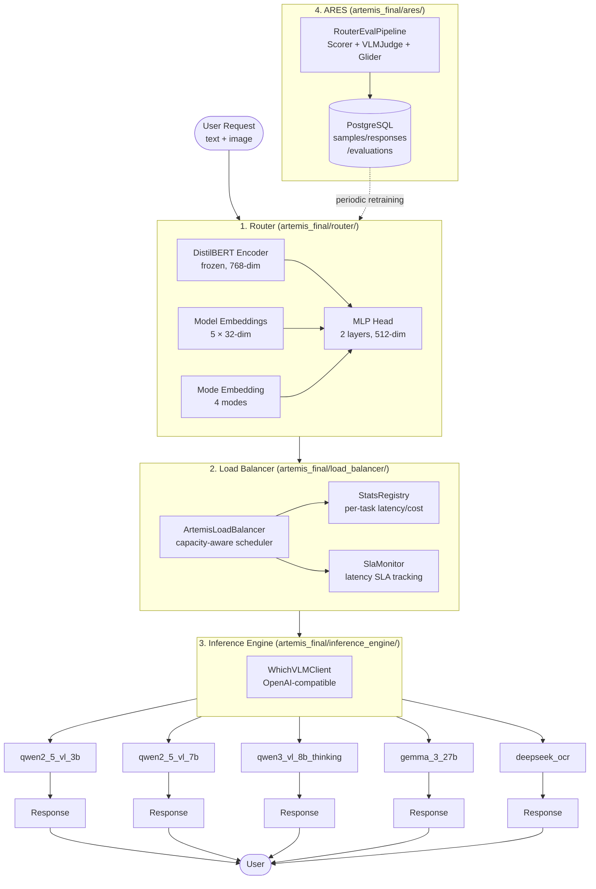
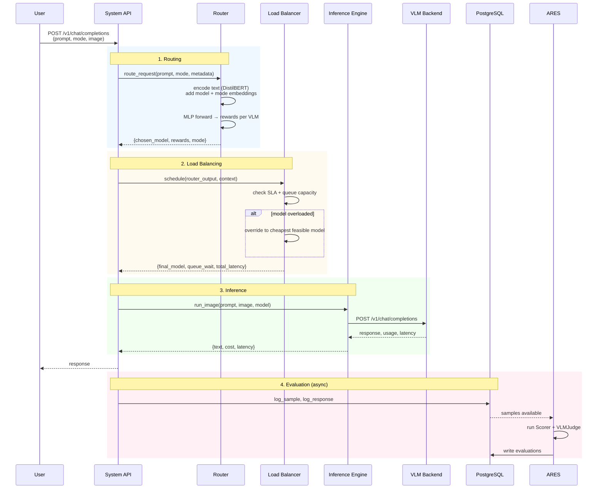
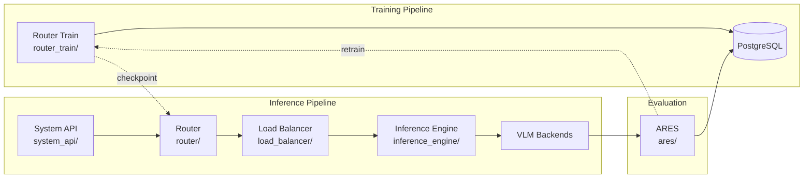

# Architecture

## System Overview

## Data Flow

## Module Dependency Graph

## Component Descriptions

### Router (`artemis_final/router/`)

The router is the core intelligence of ARTEMIS. At inference time it:

1. Encodes the input text with a frozen DistilBERT encoder
2. Concatenates model-type and mode embeddings
3. Runs the combined vector through an MLP head to predict reward scores for each VLM
4. Returns the VLM with the highest predicted reward for the given mode

Three architectures are supported:

- **RewardRouterInference** (recommended) — predicts scalar rewards via MSE loss
- **PairwiseRouterInference** — learns a ranking via margin-based loss
- **ClassicalRouterInference** — classifies which model is best via cross-entropy

### Load Balancer (`artemis_final/load_balancer/`)

After the router selects a model, the load balancer applies operational constraints:

- **SLA verification**: Checks whether the selected model's current queue would violate the latency SLA
- **Queue management**: Tracks in-flight requests per model
- **Override logic**: If constraints are violated, redirects to the next-best feasible model

The scheduler runs in `capacity_aware` mode by default and logs all decisions to its internal `SlaMonitor`.

### Inference Engine (`artemis_final/inference_engine/`)

A thin OpenAI-compatible client that:

- Calls VLM backends via the `/v1/chat/completions` endpoint
- Extracts token usage, latency, and cost from responses
- Runs both LLM (text-only) and VLM (image + text) inference through a unified `WhichVLMClient` interface

### ARES (`artemis_final/ares/`)

The evaluation and data pipeline. Key components:

- **Scorer** — evaluates responses against ground truth (accuracy, F1, etc.)
- **VLMJudge** (Molmo) — provides listwise ranking of model responses with images
- **GliderEvaluator** — optional text-only evaluator for faster scoring
- **DB operations** — reads/writes all tables in PostgreSQL

The `RouterEvalPipeline` orchestrates parallel evaluation across all samples and models, then writes results back to the database for retraining.

### Router Training (`artemis_final/router_train/`)

The training pipeline:

1. Loads profiling data from PostgreSQL (samples, responses, evaluations)
2. Computes multi-objective reward functions per (sample, model, mode) tuple
3. Builds a PyTorch dataset and trains the router with the selected loss function
4. Evaluates against oracle and baseline routers
5. Exports a `.pt` checkpoint to `checkpoints/`

Training is driven by Jupyter notebooks in `notebooks/router_train/`.

## Cross-Module Data Contracts

| Contract | Defined In | Used By | Fields |
|---|---|---|---|
| `RouterOutput` | `load_balancer/core/types.py` | LB, System API | sample_id, task_type, router_probs, preferred_model |
| `SchedulingDecision` | `load_balancer/core/types.py` | System API, inference | chosen_model, is_overloaded, est_latency_ms, est_cost_usd |
| `Sample` | `router/core/schemas.py` | Router, ARES, DB | sample_id, source, text, image, label |
| `RouterDecision` | `router/core/schemas.py` | Router, LB | chosen_model, probs, raw_logits, model_order |
| `GlobalConfig` | `common/config_loader.py` | All modules | db.url, router, load_balancer, inference_engine config |
