# Module: ARES (Evaluation)

## What It Does

Evaluates VLM responses for quality using ground-truth scoring, VLM Judge (Molmo), and Glider. Writes all data to PostgreSQL for downstream training.

## How It Fits In

Runs asynchronously after inference. Feeds evaluation results back into the retraining loop.

## Architecture

```mermaid
graph TD
    DB[(PostgreSQL<br/>samples/responses)] --> Pipe[RouterEvalPipeline]
    Pipe --> Scorer[Scorer<br/>ground truth accuracy/F1]
    Pipe --> Judge[VLMJudge Molmo<br/>listwise ranking with image]
    Pipe --> Glider[GliderEvaluator<br/>text-only fast eval]
    Scorer --> Results["{accuracy, F1,<br/>judge_score}"]
    Judge --> Results
    Glider --> Results
    Results --> DB
```

## Key Files

| File | What It Does |
|---|---|
| `public_api.py` | Module entry, init |
| `evaluation/router_eval_pipeline.py` | Full eval orchestration with ThreadPoolExecutor |
| `evaluation/evaluation.py` | Scorer (ground truth), GliderEvaluator, parse_glider_output |
| `evaluation/judge_molmo.py` | VLMJudge — Molmo-based listwise ranking |
| `evaluation/confidence.py` | estimate_confidence() — confidence scoring |
| `db/operations.py` | insert_evaluations, SQLAlchemy operations |
| `data/dataset_loader.py` | Load samples from DB |
| `configs/` | DB and model configuration |

## Status

**PLACEHOLDER.** The full eval pipeline (`RouterEvalPipeline`) is comprehensive and the scorer, judge, and glider evaluators exist. DB operations are working.

**Gaps:** `public_api.py` has multiple `return None` placeholders for error paths. Glider and Molmo may load heavy models at init time. Data collection paths are partial stubs. The pipeline depends on a working inference engine.
