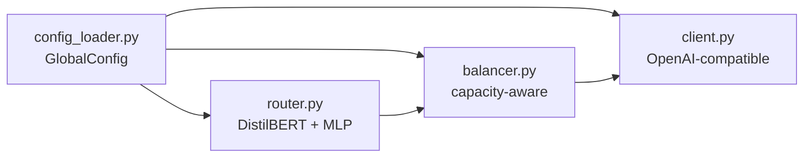

# Module: ARTEMIS Core (`artemis_core/src/artemis/`)

## What It Does

A minimal, self-contained implementation of the ARTEMIS router, inference client, load balancer, and configuration system. ~859 lines total, clean code with zero notable findings.

## Architecture

## Key Files

| File | What It Does |
|---|---|
| `common/config_loader.py` | GlobalConfig, load_global_config() |
| `common/utils.py` | Shared utilities |
| `inference/client.py` | OpenAI-compatible VLM client |
| `inference/messages.py` | Message formatting |
| `inference/models.py` | Model metadata |
| `load_balancer/balancer.py` | Capacity-aware load balancer |
| `load_balancer/types.py` | CapacityConfig, LoadBalancingResult |
| `router/model.py` | RouterModel dataclass |
| `router/router.py` | ArtemisRouter — inference entry |

## Status

**COMPLETE.** Clean, minimal implementation. Fully functional. No NotImplementedError, no placeholder returns, no TODOs. Use as reference for understanding the core ARTEMIS design pattern.
