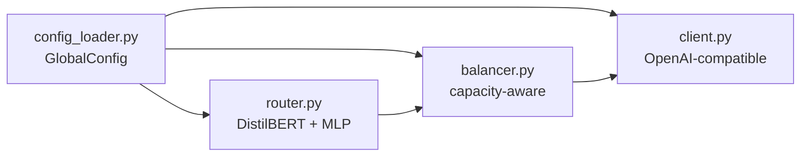

# Module: ARTEMIS Core Entry (`artemis_core/`)

## What It Does

The top-level entry wrapper for the minimal ARTEMIS implementation. The clean implementation itself is documented separately under `artemis_core/src/artemis/`.

## Architecture

## Key Files

| File | What It Does |
|---|---|
| `common/config_loader.py` | GlobalConfig, load_global_config() |
| `common/utils.py` | Shared utilities |
| `inference/client.py` | OpenAI-compatible VLM client |
| `inference/messages.py` | Message formatting |
| `inference/models.py` | Model metadata |
| `load_balancer/balancer.py` | Capacity-aware load balancer |
| `load_balancer/types.py` | CapacityConfig, LoadBalancingResult |
| `router/model.py` | RouterModel dataclass |
| `router/router.py` | ArtemisRouter — inference entry |

## Status

**PARTIAL.** `SYSTEM_STATE.md` classifies this top-level entry wrapper as partial. The nested `artemis_core/src/artemis/` module remains COMPLETE and is the reference implementation.
