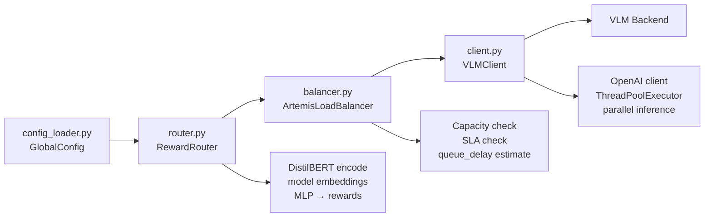

# ARTEMIS Core (`artemis_core/src/artemis/`)

## What It Does

A minimal, self-contained (~859 lines) reference implementation of the full ARTEMIS pipeline: config loading, inference client, capacity-aware load balancer, and DistilBERT + MLP router. Use this to understand the core architecture before reading the fuller `artemis_final/` implementations.

## How It Works

`RewardRouter` (router.py) loads a checkpoint with `_ConfigRemappingUnpickler` to handle config class path remapping. `ArtemisLoadBalancer` (balancer.py) tracks `ReplicaState` per model with available-at timestamps for queue delay estimation. `VLMClient` (client.py) uses `concurrent.futures.ThreadPoolExecutor` to call multiple VLM backends in parallel.

## Key Files

| File | What It Does |
|---|---|
| `common/config_loader.py` | GlobalConfig dataclass; `load_global_config(path?)` |
| `common/utils.py` | Shared utilities |
| `router/router.py` | `RewardRouter` — DistilBERT + MLP; `_load_checkpoint_safe` for pickle compatibility |
| `router/model.py` | `RewardRouterModel` + `RouterModelConfig` dataclass |
| `load_balancer/balancer.py` | `ArtemisLoadBalancer` — capacity-aware scheduling with replica state |
| `load_balancer/types.py` | `RouterOutput`, `SchedulingContext`, `SchedulingDecision`, `SimulationResult`, `ModelCapacityConfig` |
| `inference/client.py` | `VLMClient` — OpenAI-compatible parallel inference via ThreadPoolExecutor |
| `inference/messages.py` | `build_messages()` — formats prompts and images for API calls |
| `inference/models.py` | `ModelEndpoint` dataclass + `load_endpoints_from_config()` |

## Current Status

**COMPLETE.** Zero NotImplementedError, zero placeholder returns, zero TODOs across all 14 files. Fully functional reference implementation. All components work end-to-end.
