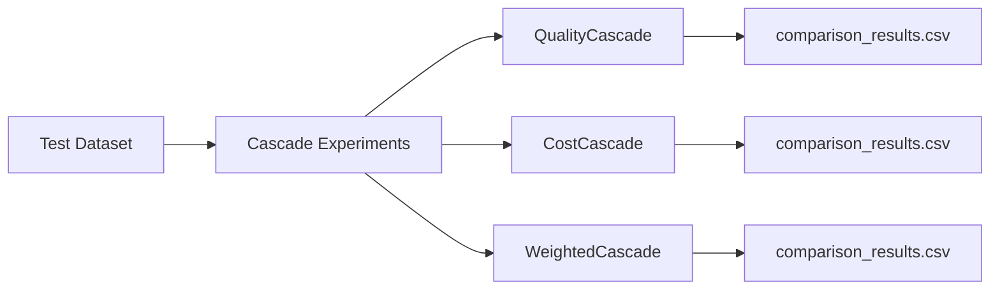

# Cascade Experiments

## What It Does

Runs comparison experiments across different cascade routing strategies. Produces CSV outputs with cost, accuracy, and latency metrics for each strategy.

## How It Works

## Key Files

| File | What It Does |
|---|---|
| Experiment scripts | Load test data; run each cascade strategy; compute metrics |
| `outputs/` | CSV result files: `comparison_results_*.csv` with cost, accuracy, latency per strategy |

## Current Status

**COMPLETE.** Experiment scripts run and produce CSV outputs. Minor placeholder returns in some helper paths — not critical to the main experiment logic.
