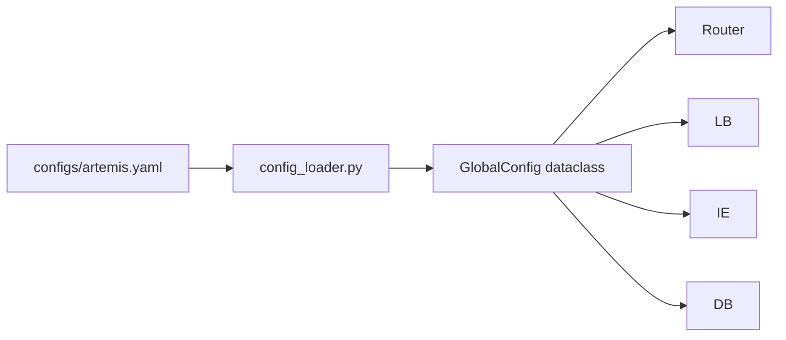

# Common Utilities

## What It Does

Shared configuration loading and type definitions used across every module in ARTEMIS. Provides the `GlobalConfig` dataclass that every other module imports for its settings.

## How It Works

`load_global_config()` reads `configs/artemis.yaml` and returns a `GlobalConfig` singleton. Modules that need specific settings import from `common` rather than reading YAML themselves.

## Key Files

| File | What It Does |
|---|---|
| `config_loader.py` | `GlobalConfig` dataclass; `load_global_config(path?)` — YAML loader with caching |
| `utils.py` | Shared utility functions |
| `types.py` | `RouterRequest`, `RouterDecision`, `LBDecision` type aliases |
| `db.py` | Database connection helpers |

## Current Status

**COMPLETE.** Fully functional. Used everywhere. No issues.
