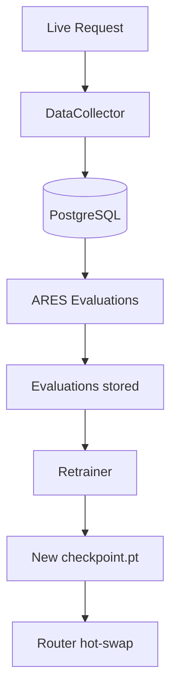

# Data Loop

## What It Does

Online learning infrastructure that logs live requests to PostgreSQL, tracks routing errors, and triggers periodic router retraining from accumulated evaluation data.

## How It Works

The loop closes when a new checkpoint is loaded into the running router without restart.

## Key Files

| File | What It Does |
|---|---|
| `collector.py` | `DataCollector` — logs samples, responses, routing decisions to PostgreSQL |
| `error_tracker.py` | `ErrorTracker` — aggregates routing errors by model and task type |
| `retrainer.py` | `Retrainer` — periodic retraining (empty body: no automated retraining) |
| `traffic_simulator.py` | Synthetic traffic generator |

## Current Status

**PLACEHOLDER.** `DataCollector` and `ErrorTracker` structures exist. `retrainer.py::retrain()` body is empty — no automated retraining. The loop is not closed in production. Use router training notebooks for manual retraining.
