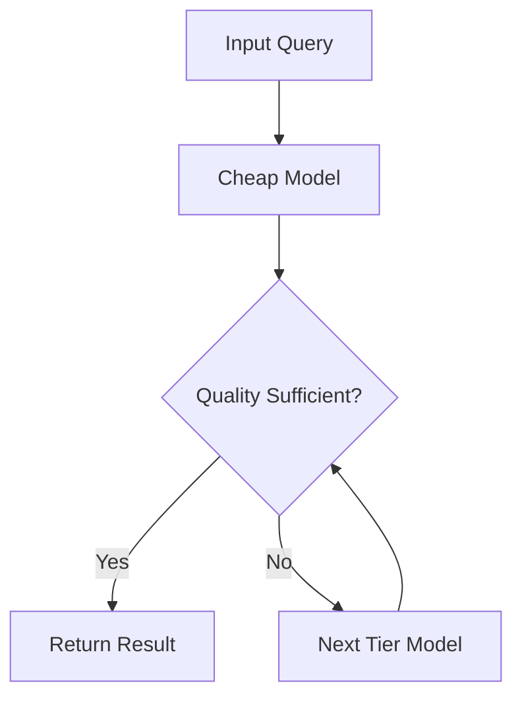

# FrugalGPT Module

> Status: PARTIAL — Original benchmark implementation
> Entry: `code_base/frugal_gpt/FrugalGPT/`

---

## Overview

FrugalGPT is a **cost-aware cascade routing** system that sequentially tries cheaper models before escalating to expensive ones, using lightweight predictors to decide when to stop.

---

## Architecture

---

## Key Components

| File | Purpose |
|------|---------|
| `FrugalGPT/src/FrugalGPT/frugal_gpt.py` | Main cascade logic |
| `FrugalGPT/src/FrugalGPT/models.py` | Model wrappers and configs |
| `FrugalGPT/intro.ipynb` | Demo notebook |

---

## Implementation Status

- **Cascade Logic**: ✅ Working
- **Quality Predictors**: ⚠️ Partially implemented
- **Production Hardening**: ❌ Not started
