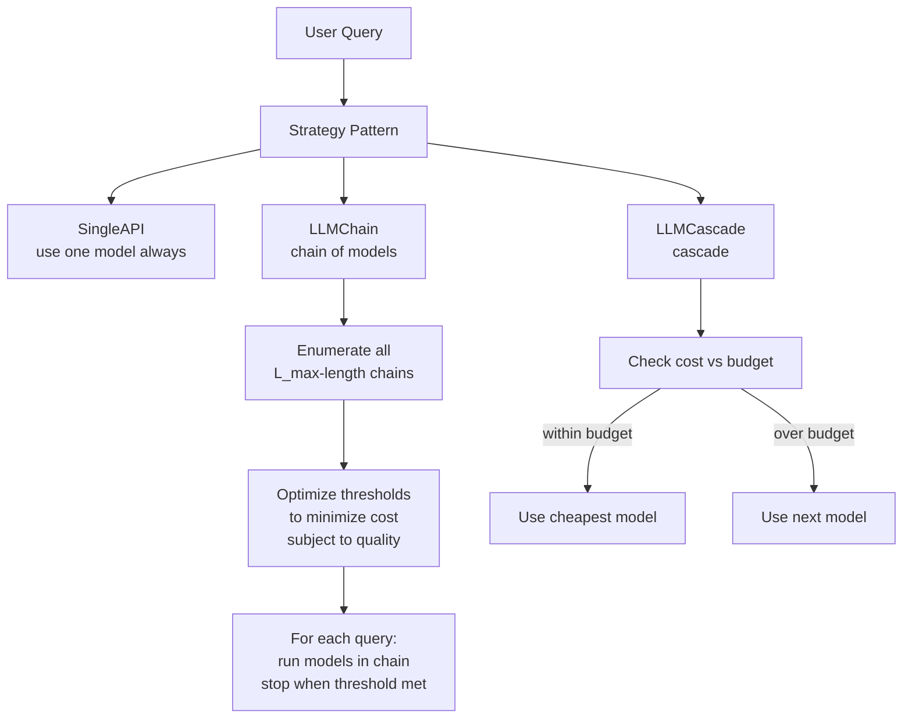

# FrugalGPT

## What It Does

FrugalGPT decides how to answer a query using LLMs — it can use a single model, a chain of models (where a cheap model tries first and hands off to an expensive one if needed), or a cascade. The goal is to minimize API cost while meeting a quality threshold.

## How It Works

## Architecture

The system uses a **Strategy pattern** (`llmchain.py`):

- `Strategy` — abstract base class with `train()`, `predict()`, `loadstrategy()`, `savestrategy()`
- `SingleAPI` — stub; always uses the first model
- `LLMChain` — chains multiple models in sequence, stopping when a quality threshold is met

The **Model Service** (`modelservice.py`) provides API access to multiple LLM providers via a unified interface:

| Provider | Endpoint | Notes |
|---|---|---|
| OpenAI | `/v1/engines/{engine}/completions` | Legacy completion API |
| OpenAI Chat | `/v1/chat/completions` | Modern chat API |
| AI21 Studio | `/studio/v1/{engine}/complete` | Jurassic models |
| Cohere | `/generate` | Cohere Generate |
| Anthropic | `/messages` | Claude via Anthropic API |
| Google Gemini | `GenerativeModel` | Gemini via google-generativeai |
| Together AI | `/chat/completions` | Together AI hosted models |
| ForeFront AI | Custom endpoints | Codegen and Pythia |

## Key Files

| File | What it does |
|---|---|
| `src/service/modelservice.py` | All API providers; `GenerationParameter`; `_PROVIDER_MAP` factory |
| `src/service/utils.py` | `compute_cost()` — token-based billing |
| `src/orchestration/llmchain.py` | Strategy pattern: Strategy, SingleAPI, LLMChain |
| `src/FrugalGPT/optimizer.py` | `construct_data()`, `optimize()` — threshold optimization |
| `src/FrugalGPT/frugalgpt.py` | FrugalLLM main class |
| `src/FrugalGPT/llmcache.py` | Response caching to avoid re-calls |
| `src/FrugalGPT/evaluate.py` | Evaluation harness |

## Current Status

**PARTIAL.** The Model Service architecture is complete with providers for 8 API backends, but all are stubs (`raise NotImplementedError`). The LLMChain strategy has complete train/predict logic but `SingleAPI` is a stub. The optimizer and scoring modules are complete.

**To use this module:** complete the `NotImplementedError` stubs in `modelservice.py` and ensure all API keys are set as environment variables.
