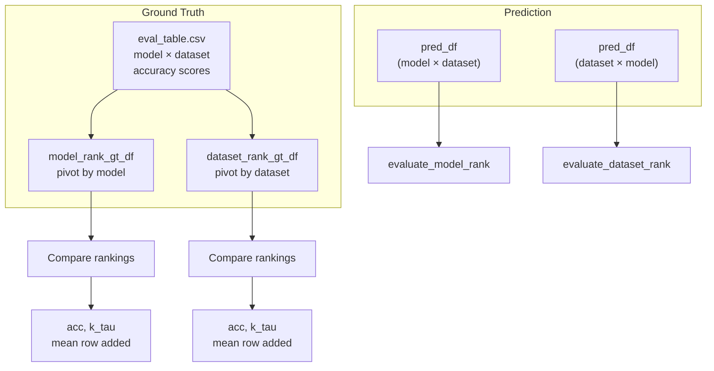

# LOVM (Large Omnidirectional VLM Manager)

## What It Does

LOVM is a benchmark framework for evaluating how well different Vision-Language Models (LVMs) perform across datasets — using natural language descriptions of datasets rather than running the models themselves. It predicts model rankings and compares them against ground truth.

There are two components:

1. **LOVM Benchmark** (`lovm.py`) — Given a predicted ranking of models or datasets, compute accuracy, Kendall's tau, and L1 loss against the known ground truth.

2. **ModelGPT Predictor** (`modelGPT/`) — Uses GPT to predict dataset or model rankings from text features, enabling zero-shot ranking without running models.

## How It Works

## Key Files

| File | What it does |
|---|---|
| `LOVM/LOVM/lovm.py` | Main `LOVM` class — evaluates model/dataset rankings |
| `LOVM/LOVM/constants/constants.py` | Ground truth path, NUM_RANK=5, column names |
| `LOVM/LOVM/modelGPT/model_gpt_predictor.py` | ModelGPTPredictor — GPT-based ranking via LOO cross-validation |
| `LOVM/LOVM/modelGPT/encode_dataset.py` | Encode dataset metadata into text features |
| `LOVM/LOVM/modelGPT/gen_caption_dataset.py` | Generate caption-based synthetic datasets |
| `LOVM/generate_results.py` | Generate full benchmark results |

## Evaluation Modes

| Mode | Method | Metrics |
|---|---|---|
| **Dataset ranking** | Predict which datasets a model performs best on | Accuracy, Kendall's tau |
| **Model ranking** | Predict which models rank highest on each dataset | Accuracy, Kendall's tau |
| **Model prediction** | Predict absolute model performance scores | L1 loss |

## Current Status

**COMPLETE.** LOVM benchmark is fully functional. The single `return 0` at `lovm.py:54` is intentional — it returns 0 correlation when fewer than 3 items are ranked (to avoid NaN). ModelGPT predictor requires an OpenAI API key. All evaluation metrics (accuracy, Kendall's tau, L1) are implemented and tested.
