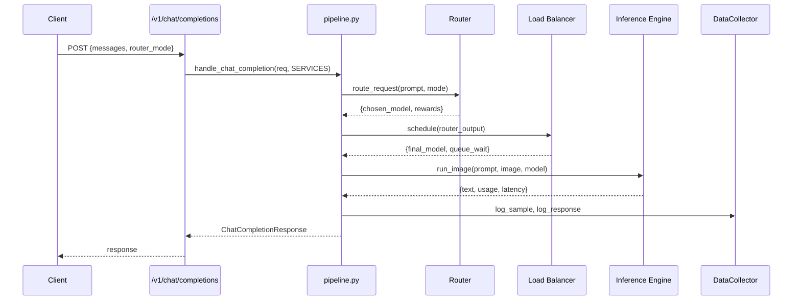

# System API

## What It Does

FastAPI application that exposes an OpenAI-compatible `/v1/chat/completions` endpoint. It orchestrates the full ARTEMIS pipeline — Router → Load Balancer → Inference Engine — for each request and logs decisions to PostgreSQL for retraining.

## How It Works

## Key Files

| File | What It Does |
|---|---|
| `main.py` | FastAPI app with lifespan; defines all endpoints; `/health`, `/v1/chat/completions`, `/feedback`, `/admin/retrain` |
| `pipeline.py` | `init_system()` — wires RouterService + LoadBalancerService + InferenceService + DataCollector. `handle_chat_completion()` — full orchestration. `handle_feedback()` — stores user feedback. `trigger_retrain()` — stubs retraining. |
| `schemas.py` | Pydantic models: ChatCompletionRequest, ChatCompletionResponse, FeedbackRequest, RetrainResponse |

## Current Status

**COMPLETE.** FastAPI endpoints are implemented and functional. The full pipeline wiring (`init_system`) initializes all services. Depends on Router, Load Balancer, and Inference Engine all being functional for end-to-end requests. `/admin/retrain` is a stub (calls `trigger_retrain()` which delegates to `data_loop/retrainer.py` — which has an empty `retrain()` body).
