# Artemis VLM Routing System – Design Specification

## 0. High-Level Goal

Build a **task-aware VLM routing system** that:

- Takes **text + one or more images** as input.
- Routes to one of **N VLMs** (e.g., 3B / 7B / 27B, etc.).
- Uses a **cheap text-based router** (no heavy vision encoder at inference).
- Enforces **global SLAs**:
  - **Global accuracy** target for the run.
  - **Total cost budget** for the run / task.
  - **Latency per task** SLAs (with realistic floors derived from profiled models).
- Uses a **load balancer / SLA manager** that:
  - Enforces SLAs under varying load.
  - Reacts to **request rate** and **per-model queue lengths**.
  - Uses **router confidence** and **model performance profiles**.
  - Supports different **routing modes**: accuracy, fast, cheap, balanced, router.
- Supports **simulation mode** (SQL-backed replay with variable request rates) and **live mode** (real VLM endpoints).
- Logs **all behavior** to a SQL DB for evaluation and continuous retraining.

This system is evaluated primarily in **simulation mode** (for the professor and Docker demo), and optionally in **live mode** on Pace using real VLMs.

---

## 1. External Interface

### 1.1 Request Input

The system exposes an API that accepts a multimodal request:

```jsonc
{
  "messages": [...],           // text conversation or single prompt
  "images": ["img_id1", ...],  // one or more images (IDs or bytes)
  "task_type": "captioning" | "chart_qa" | "table_qa" | "vqa" | "...",
  "request_id": "optional"
}
```

Notes:

- Users **do not** specify per-request SLAs.
- `task_type` is required (in sim: from Cauldron; in live: from user or simple classifier).
- In simulation mode, `images` / `task_type` typically correspond to a `sample_id` in DB.

### 1.2 Response Output

The system returns:

```jsonc
{
  "request_id": "...",
  "chosen_model": "qwen_vl_7b",
  "answer": "...",
  "metadata": {
    "latency_ms": 1234,
    "cost_usd": 0.0012,
    "router_probs": {"qwen_vl_3b": 0.2, "llava_7b": 0.5, "qwen_vl_27b": 0.3},
    "router_confidence": 0.5,
    "routing_mode": "balanced",
    "sla_violations": ["latency"]    // or []
  }
}
```

Under:

- **Simulation mode**: `answer` and `score` are read from DB (`model_runs`); latency is simulated.
- **Live mode**: `answer` comes from the real VLM endpoint; latency is measured.

---

## 2. Modes: Simulation vs Live

### 2.1 Simulation Mode

- **Primary evaluation / demo mode**.
- Uses SQL DB to store and read:
  - `samples` (Cauldron subset).
  - `model_runs` (per-sample, per-model outputs: `answer_text`, `score`, `latency_ms`, `cost_usd`).
  - `routing_labels` (utility-based best models per mode).
- Models are **simulated**:
  - Sleep for `latency_ms` (maybe plus noise).
  - Return `answer_text` and `score` read from DB.
- Supports **variable request rates** to emulate different loads (e.g., 1 req/s, 5 req/s, 20 req/s).

### 2.2 Live Mode (PoC Only)

- Uses actual model endpoints (e.g., vLLM deployments of Qwen / LLaVA etc.).
- Subject to **modest request rates** (keep it safe for CPU-based router and limited GPU capacity).
- DB used for:
  - logging requests,
  - optional evaluation (via offline critic / GLiDe),
  - retraining.

Default for Docker: **simulation mode**.

---

## 3. SLAs & Configuration

### 3.1 SLA Types (User-Facing)

The user specifies **global** SLAs in `config.yaml`:

- **Global accuracy target** for the run:
  - `min_global_accuracy` – average score across all requests in the evaluation window.
- **Total cost budget** for the run:
  - `total_cost_budget_usd` – once exceeded, routing stops.
- **Latency per task**:
  - `latency_per_task_ms[task_type]` – average latency target per task type.

These values are **bounded by profiled model performance**:

- `latency_per_task_ms[task]` cannot be set below a floor determined from profiling.

### 3.2 Config Structure

Example `config.yaml`:

```yaml
mode: "simulation"   # or "live"

sla:
  min_global_accuracy: 0.85         # global score target
  total_cost_budget_usd: 10.0       # cost budget for the run
  latency_per_task_ms:
    captioning: 2500
    chart_qa: 3500
    table_qa: 4000

metrics:
  window_num_requests: 1000         # sliding window for SLA metrics

routing_mode: "balanced"            # "router" | "accuracy" | "fast" | "cheap" | "balanced"

router:
  confidence_threshold: 0.6         # low confidence if max_p < threshold
  error_utility_margin: 0.05        # threshold for labeling misroutes

models:
  - name: qwen_vl_3b
    endpoint: "http://qwen3b:8000/infer"
    max_qps: 10
  - name: llava_7b
    endpoint: "http://llava7b:8000/infer"
    max_qps: 6
  - name: qwen_vl_27b
    endpoint: "http://qwen27b:8000/infer"
    max_qps: 3

db:
  uri: "postgresql+psycopg2://..."

retraining:
  enabled: true
  error_buffer_size: 200
  max_finetune_steps: 1000
```

### 3.3 SLA Realism Check at Startup

On startup the system:

1. Loads profiling data from DB:
   - `avg_latency_m(task)`, `avg_accuracy_m(task)`, `avg_cost_m(task)` for each model `m` and task `t`.
2. Computes **latency floors** for each task:
   - `latency_floor(task) = min_m(avg_latency_m(task)) + buffer_ms`.
3. If `latency_per_task_ms[task] < latency_floor(task)`:
   - Adjust up to `latency_floor(task)`.
   - Log a **warning** about unrealistic SLAs.
4. Optionally checks that `min_global_accuracy` and `total_cost_budget_usd` are not wildly inconsistent with profiling data, and warns if so.

---

## 4. Data Model & DB Schema (Conceptual)

### 4.1 Tables

1. `samples`
   - `id`
   - `task_type`
   - `image_path` or `image_bytes`
   - `question_text`
   - `ground_truth`
   - `metadata_json` (e.g., resolution, OCR length, etc.)

2. `model_runs`
   - `id`
   - `sample_id` (FK → `samples.id`)
   - `model_name`
   - `answer_text`
   - `latency_ms`
   - `cost_usd`
   - `score` (normalized [0,1])
   - `utilities_json` (per-mode utilities: `accuracy`, `fast`, `cheap`, `balanced`)

3. `routing_labels`
   - `sample_id`
   - `best_model_name` (for a chosen utility mode, e.g., balanced)
   - `utility_distribution_json` (soft distribution for KL)

4. `requests_log`
   - `request_id`
   - `sample_id` (if from simulation)
   - `timestamp`
   - `task_type`
   - `chosen_model`
   - `router_probs_json`
   - `router_confidence`
   - `routing_mode_used`
   - `estimated_latency_ms`
   - `actual_latency_ms`
   - `cost_usd`
   - `score` (if available)
   - `sla_violations_json` (array: e.g., `["latency"]`)

5. `router_error_buffer`
   - `id`
   - `sample_id`
   - `chosen_model`
   - `best_model`
   - `utility_gap`
   - any additional features needed.

6. `models_state`
   - `model_name`
   - `healthy` (bool)
   - `last_checked`
   - `avg_latency_ms`
   - `avg_accuracy`
   - `avg_cost_usd`

---

## 5. Router Design

### 5.1 Constraints

- Must be **cheap** (CPU-friendly).
- **No heavy vision encoder** during inference.
- Input: only **text + light metadata**.

### 5.2 Inputs

Per request, router takes:

- `question_text` (possibly concatenated messages).
- `task_type` (one-hot or embedding).
- Optional metadata from DB or request:
  - `text_length`, number of digits,
  - `image_resolution` (H, W),
  - `ocr_text_length`, etc.

### 5.3 Outputs

- `p` – probability distribution over all known models `[p1, ..., pM]`.
- `max_p` – router confidence.

### 5.4 Handling Active Model Subset

At runtime, some models may be disabled or unhealthy.

- Router always outputs over full set `{m1...mM}`.
- A mask `mask_active` is applied in the load balancer:

```python
p_active = normalize(p * mask_active)
```

This allows dynamic model subsets without retraining.

### 5.5 Training Targets & Objective

From `model_runs` and utility computation:

- For each sample `s` and model `m`:
  - compute utilities per mode, e.g.,

    ```text
    u_accuracy(m), u_fast(m), u_cheap(m), u_balanced(m)
    ```

- For training the router (for its primary mode, e.g., `balanced`):
  - **Hard label**:
    - `best_model = argmax_m u_balanced(m)`
  - **Soft label**:
    - `q_m = softmax(u_balanced(m) / T)` for some temperature `T`.

Router loss:

```text
L = α * CE(p, best_model) + β * KL(p || q)
```

Router training is separate from system logic; router is **pretrained offline**, then loaded by the routing service.

---

## 6. Load Balancer / SLA Manager

This is the core “system” component.

### 6.1 Inputs (Per Request)

For each incoming request:

- From router:
  - `p` (masked to active models → `p_active`).
  - `max_p` (router confidence).
- From request:
  - `task_type`.
  - `arrival_time`.
- From system state:
  - `current_cost_spent` (sum of cost so far).
  - Rolling metrics over last `window_num_requests`:
    - `avg_latency_T`, `p95_latency_T` per task.
    - `global_accuracy`.
  - `queue_len_m` per model (logical queues).
  - `current_rps` (requests/sec).
- From DB / profiling:
  - `avg_latency_m(task)`.
  - `avg_accuracy_m(task)`.
  - `avg_cost_m(task)`.
  - `max_qps_m`.

### 6.2 Global Cost Constraint

- `current_cost_spent` is increased after each request by `cost_usd`.
- If `current_cost_spent >= total_cost_budget_usd`:
  - **Stop routing** further requests:
    - In batch/simulation: abort remaining requests and report cost SLA failure.
    - In live mode: respond with “budget exhausted” error until budget is reset.

No `max_avg_cost` – the constraint is solely **total cost**.

### 6.3 Latency per Task

For each task `T`:

- Track `avg_latency_T` and optionally `p95_latency_T` over a window of requests of that task.
- SLA: `avg_latency_T ≤ latency_per_task_ms[T]`.

Before assigning a model `m` to a request of task `T`, LB computes:

```python
queue_wait_m = (queue_len_m / max_qps_m) * 1000
estimated_latency_mT = queue_wait_m + avg_latency_m(task=T)
```

- If `estimated_latency_mT` is likely to push `avg_latency_T` above SLA:
  - prefer a **faster model**, subject to:
    - global accuracy target,
    - remaining cost budget.

### 6.4 Global Accuracy Constraint

- Track `global_accuracy` as average score over the sliding window.
- SLA: `global_accuracy ≥ min_global_accuracy`.

If `global_accuracy` drops below `min_global_accuracy`:

- LB should bias toward **more accurate models**:
  - e.g., pick highest `avg_accuracy_m(task)` among router top-k, even if more expensive/slower.
- Once accuracy recovers, LB can resume normal mode behavior.

---

## 7. Routing Modes & Low-Confidence Handling

### 7.1 Routing Modes

Configured as `routing_mode`:

- `"router"` – trust router’s top-1 (unless SLA forces change).
- `"accuracy"` – prefer highest-accuracy models.
- `"fast"` – prefer lowest-latency models.
- `"cheap"` – prefer lowest-cost models.
- `"balanced"` – use precomputed `u_balanced(m)`.

### 7.2 Low-Confidence Decisions

If `max_p < router.confidence_threshold`, route is considered **low-confidence**.

Then LB:

1. Takes **top-K models** from `p_active` (e.g., K=3).
2. Depending on `routing_mode`:

   - `"router"`:
     - Start from router top-1, adjust only if SLA risks are high.
   - `"accuracy"`:
     - Choose model with highest `avg_accuracy_m(task)` among top-K.
   - `"fast"`:
     - Choose model with lowest `avg_latency_m(task)` among top-K.
   - `"cheap"`:
     - Choose model with lowest `avg_cost_m(task)` among top-K.
   - `"balanced"`:
     - Choose model with highest `u_balanced(m)` among top-K from DB.

3. If that chosen model still fails latency or will push cost over budget:
   - choose next feasible model or log an SLA violation and continue best-effort.

### 7.3 Other Fallbacks

- **Latency fallback**:
  - If predicted `estimated_latency_mT` is too high, reroute to faster model (possibly outside router top-K if needed).
- **Cost fallback**:
  - If choosing a model would push `current_cost_spent` dangerously close to budget, LB prefers a cheaper alternative (if accuracy allows).

---

## 8. Model Executors

### 8.1 Simulation Executor

- For `(sample_id, model_name)`, reads from `model_runs`:
  - `answer_text`
  - `score`
  - `latency_ms`
  - `cost_usd`
- Sleeps for `latency_ms` (or slightly noisy variant).
- Returns `answer_text`, `score`, `latency_ms`, `cost_usd`.

### 8.2 Live Executor

- Sends HTTP request to `endpoint` with:
  - text + image(s).
- Measures `actual_latency_ms`.
- Estimates `cost_usd` from tokens * known price.
- (Optional) sends answer to critic/GLiDe offline to compute `score`.

---

## 9. Metrics, Logging & Streaming

### 9.1 Streaming & Load

- Requests are pulled from:
  - RabbitMQ queue, or
  - simple in-process queue for simulation.
- For each request:
  - record `arrival_time`.
- Maintain a sliding window of timestamps to compute:

```python
current_rps = num_requests_in_last_10s / 10.0
```

- `current_rps` is used for:
  - understanding load regime,
  - interpreting queue lengths and estimated latencies.

### 9.2 Logging to DB

For each processed request, write to `requests_log`:

- `request_id`
- `sample_id` (optional)
- `timestamp`
- `task_type`
- `chosen_model`
- `router_probs_json`
- `router_confidence`
- `routing_mode_used`
- `estimated_latency_ms`
- `actual_latency_ms`
- `cost_usd`
- `score` (if available)
- `sla_violations_json`

### 9.3 Metric Computation

Using `requests_log`, maintain in-memory metrics over last `window_num_requests`:

- Per task:
  - `avg_latency_T`, `p95_latency_T`.
- Global:
  - `global_accuracy` (mean score),
  - `current_cost_spent`.

These are updated per request and used by the LB.

---

## 10. Misroutes & Continuous Retraining

### 10.1 Misroute Definition

For a given (simulated) request with `sample_id`:

- From `routing_labels` and `model_runs` for the current mode (e.g., `balanced`):
  - `u_best` – utility for `best_model`.
  - `u_chosen` – utility for `chosen_model`.

Define **misroute** if:

```text
u_best - u_chosen > router.error_utility_margin
```

These errors are added to `router_error_buffer`.

### 10.2 Retraining Pipeline

Triggered when `router_error_buffer` reaches `error_buffer_size`:

1. Build a training dataset:
   - all misroute samples from `router_error_buffer`,
   - plus some correctly routed samples for balance.
2. Fine-tune router:
   - same architecture, same inputs/outputs,
   - only adjust **head/MLP layers** to keep training cheap.
3. Save a new `router.ckpt` and reload it into router service.

This demonstrates **continuous adaptation** based on observed performance.

---

## 11. Health Checks & Degraded Modes

### 11.1 Model Health

- At startup:
  - ping each model endpoint,
  - mark `healthy` status in `models_state`.
- At runtime:
  - periodic health checks.
  - If a model becomes unhealthy:
    - mark it inactive,
    - LB masks its probability in `p_active`.

### 11.2 Router Health

- If router service fails:
  - fallback to **static per-task routing** (simple mapping from `task_type` → model).
  - log degraded mode in DB.

### 11.3 DB Health

- If DB unavailable in simulation:
  - abort with clear error.
- If DB unavailable in live:
  - still serve routing decisions,
  - buffer logs locally and/or accept some missing metrics.

---

## 12. Dockerization & Professor Demo

- Docker image runs:
  - API server (FastAPI/Flask) exposing:
    - `/query` – route a single request.
    - `/simulate` – run a predefined simulation over a Cauldron subset with varying request rates.
    - `/retrain` – trigger retraining from `router_error_buffer` (optional).
- Config-driven:
  - `mode: simulation` by default.
  - DB URI, SLA, models configured via `config.yaml`.

For the professor:

- Provide a `README` with:
  - `docker build -t vlm-router-system .`
  - `docker run vlm-router-system`
  - Example `curl` / script to hit `/simulate` and print:
    - cost,
    - latency,
    - accuracy vs SLAs,
    - routing decisions distribution across models.

---

## 13. Summary of Key Invariants

- Input: **text + images + task_type**; user does **not** pass SLAs per request.
- SLAs: **global accuracy**, **total cost budget**, **latency per task**.
- Router: **cheap**, text-based, outputs model probability distribution + confidence.
- Load Balancer: enforces SLAs, uses current metrics, mode, router confidence, and per-model profiles.
- Cost: **hard stop** when `total_cost_budget_usd` exceeded.
- Latency: enforced per task with realistic floors from profiling.
- Accuracy: global target tracked over sliding window; LB shifts policy if accuracy drops.
- Everything is **logged in DB**, enabling analysis and retraining.

```mermaid
 flowchart LR
    %% ============================================================
    %% Artemis VLM Router – System Architecture
    %% (for research paper figure)
    %% ============================================================

    %% ---------- External World ----------
    U["User / Client"]
    subgraph EXT["External Interfaces"]
        API["Router API<br/>(HTTP / gRPC)"]
        Q["Request Queue<br/>(e.g., RabbitMQ)"]
    end

    U --> API --> Q

    %% ---------- Config & Profiling ----------
    subgraph CFG["Configuration & Profiling"]
        Cfg["Config.yaml<br/>(SLAs, modes, model list)"]
        Prof["Profiling Data<br/>(per-model latency, cost,<br/>accuracy, utilities)"]
    end

    Cfg --> LB
    Prof --> LB
    Prof --> SimExec

    %% ---------- Core Routing Service ----------
    subgraph CORE["Routing Service"]
        direction LR

        subgraph ROUTER["Cheap Text-based Router"]
            Feat["Feature Extractor<br/>(text + task + metadata)"]
            RModel["Router Model<br/>(small encoder + MLP)"]
        end

        subgraph LB["Load Balancer /<br/>SLA Manager"]
            SLA["SLA Logic<br/>(global accuracy,<br/>total cost budget,<br/>per-task latency)"]
            ModeSel["Mode Logic<br/>(router / accuracy / fast / cheap / balanced)"]
            QueueState["Load & Queue State<br/>(RPS, per-model queue_len,<br/>estimated latency)"]
        end
    end

    %% Data flow inside CORE
    Q --> Feat --> RModel
    RModel -->|"p(model), confidence"| SLA
    Cfg --> SLA
    SLA --> ModeSel
    QueueState --> SLA
    ModeSel -->|"chosen model"| ModelSel

    %% Abstract node representing the chosen model
    ModelSel(("Model Decision"))

    %% ---------- Model Execution Layer ----------
    subgraph EXEC["Model Execution Layer"]
        direction LR

        subgraph LIVE["Live VLM Endpoints"]
            LiveExec["Live Model Executor<br/>(HTTP to VLMs)"]
        end

        subgraph SIM["Simulation Mode"]
            SimExec["Simulation Executor<br/>(reads model_runs from DB)"]
        end
    end

    %% Mode-dependent execution
    ModelSel -->|"mode = live"| LiveExec
    ModelSel -->|"mode = simulation"| SimExec

    %% ---------- SQL Database & Data Plane ----------
    subgraph DB["SQL Database"]
        Samples[("samples")]
        ModelRuns[("model_runs")]
        RoutingLabels[("routing_labels")]
        ReqLog[("requests_log")]
        ErrBuf[("router_error_buffer")]
        ModelState[("models_state")]
    end

    %% Simulation reads from DB
    SimExec -->|"answers, scores, latency, cost"| ReqLog
    Samples --- ModelRuns
    ModelRuns --- RoutingLabels
    ModelRuns --> Prof
    RoutingLabels --> Prof

    %% Live execution logs to DB
    LiveExec -->|"answer, latency, cost, score?"| ReqLog

    %% CORE uses DB state
    ReqLog --> Metrics
    ModelState --> QueueState

    %% ---------- Metrics & Retraining ----------
    subgraph META["Metrics, Monitoring & Retraining"]
        direction TB
        Metrics["Metrics Tracker<br/>(global accuracy,<br/>per-task latency,<br/>cost usage)"]
        Misroute["Misroute Detector<br/>(utility_gap > margin)"]
        Retrain["Router Retrainer<br/>(fine-tune router head)"]
    end

    ReqLog --> Metrics
    Metrics --> QueueState

    %% Misroutes & retraining loop
    Metrics --> Misroute
    Misroute --> ErrBuf
    ErrBuf --> Retrain
    Retrain -->|"updated weights"| RModel

    %% ---------- Health & Model State ----------
    subgraph HEALTH["Health Checks & Model State"]
        HC["Health Checker<br/>(ping VLM endpoints)"]
    end

    HC --> ModelState
    ModelState --> LB

    %% ---------- User Feedback ----------
    LiveExec --> APIResp["API Response<br/>(answer + metadata)"]
    SimExec --> APIResp
    APIResp --> U
```



